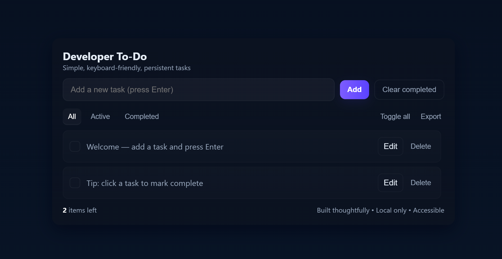

# 📝 To-Do List App

A simple, clean, and responsive *To-Do List* built using *HTML, CSS, and JavaScript*.

## ✨ Features
- Add new tasks  
- Mark tasks as complete/incomplete  
- Edit and delete tasks  
- Filter (All / Active / Completed)  
- Clear completed tasks  
- Persistent storage with LocalStorage  
- Export tasks to JSON  

## 🚀 Demo
Hosted with GitHub Pages:  
👉 [Live Demo](https://anshikasindhav290624-max.github.io/to-do-list/)
## 📸 Screenshot
Here’s how the app looks:



## ⚡ How to Run Locally
1. Clone the repo  
   ```bash
   git clone https://github.com/anshikasindhav290624-max/to-do-list.git 